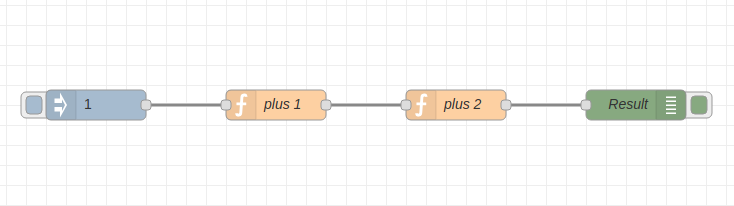

# Node Red CI Example

This is a example of Node Red npm test for Continuous Integration.

## What
The Node Red flow is simple, it has two functions as of below. Inject node inject a number 1 and debug node will display 4 at the end (1 + 1 + 2 = 4).
  
The test script will test following cases by npm test:
* 1+1=2
* 1+2=3
* 1+1+2=4

## Test Procedure
```bash
git clone https://github.com/pauldeng/node-red-ci-example.git
cd node-red-ci-example
npm install
npm test
```

## CI Service Integration
### Travis CI
add .travis.yml as in the file  
check out the Travis CI output: https://travis-ci.com/pauldeng/node-red-ci-example
### BitBucket Pipelines
add bitbucket-pipelines.yml

